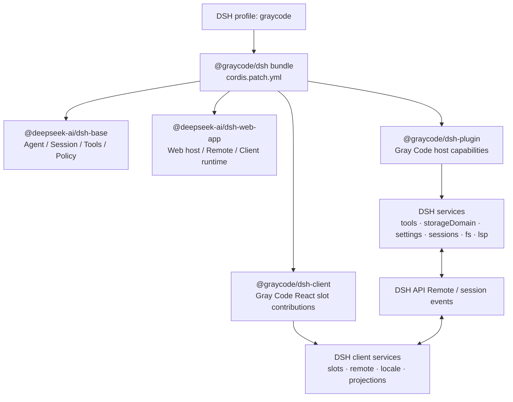
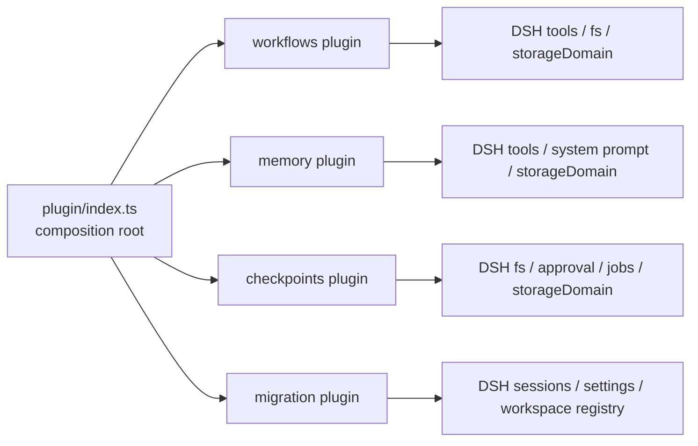
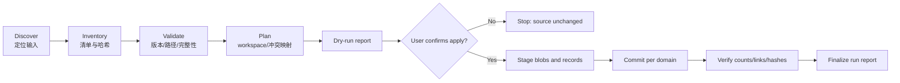
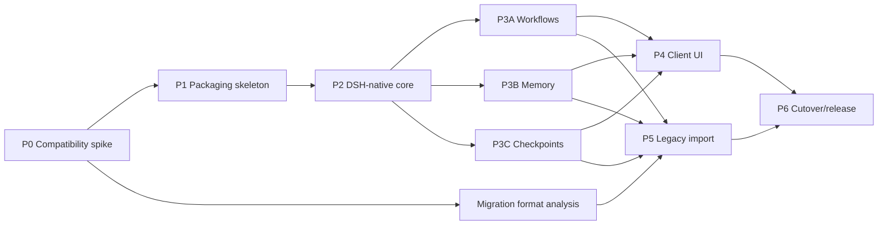

# Gray Code 迁移为 DSH 插件的实施规划

> 状态：Draft v2（实施基线稿）
>
> Gray Code 基线：`067f9693f69a1ecf0e5f36436ba50d44fe1b4a3d`（`main`，v1.5.4）
>
> DSH 参考基线：`47f943859bef60e4160492346772ded9b24f765a`（`deepseek-ai/deepseek-harness` 的 `master`）

## 1. 结论

本次改造应采用“**DSH 原生插件化重构**”，而不是在 DSH 外面保留一层 VS Code 兼容壳。

目标形态是：

1. Gray Code 以一个可通过 `dsh plugin add` 安装的 DSH **组合包（bundle）**交付。
2. DSH 负责 Agent Loop、会话、模型适配、工具执行流水线、权限、沙箱、工作区、存储、设置、凭据和 Web 宿主。
3. Gray Code 只保留并迁移自身有差异化价值的能力，例如 Design / Progress / Review 工作流、永久记忆、存档点语义、专有展示和旧数据导入。
4. 删除 VS Code 扩展入口、Webview 消息桥、VSIX 打包、VS Code Settings/Memento/SecretStorage 和编辑器专属 UI。
5. 前端不再把现有 Vue 应用整体嵌入 DSH。MVP 先使用 DSH 自带 Web UI，随后将确有必要的 Gray Code 界面改写为 DSH Client 插件和 React slot 组件。

这条路线的核心原因是 DSH 已经提供了 Gray Code 当前重复实现的大部分底层能力。如果仅把 VS Code Webview 换成 HTTP 页面，却继续保留自有 Agent Loop、会话、工具注册和设置系统，项目虽然“能在 DSH 旁边运行”，但并没有真正成为 DSH 插件，后续还会长期维护两套内核。

### 1.1 本次复审结论

第一版的总体方向成立，但在进入实施前必须补上以下约束：

1. **先做能力探针，再承诺替换。** 文中“采用 DSH”的能力表示默认方向，不表示已经证明 100% 等价。Phase 0 必须用可执行契约测试验证模型协议、会话分支、工具展示、MCP、Skills、LSP、审批和 Client 扩展面。
2. **宿主插件内部按领域子插件拆分。** npm 包先保持三个，但 `@graycode/dsh-plugin` 内部至少拆成 workflows、memory、checkpoints、migration 四个 Cordis 子插件，避免生命周期、依赖和配置汇成一个巨型 `apply()`。
3. **迁移入口不能只依赖现有设置导出。** Gray Code 1.5.4 的设置导出只包含设置、渠道、MCP 和 Skills，不包含会话、记忆和工作区存档点；完整迁移必须接受旧数据目录，或先为 legacy 版本增加一份“完整备份”导出器。
4. **工作区快照采用“结构化元数据 + 文件/Blob 存储”。** `storageDomain` 适合索引、状态和 legacy id 映射，不应承载大量工作区文件内容。快照 Blob 放在插件私有根目录，恢复目标文件仍通过 DSH fs、审批和沙箱。
5. **UI 不机械翻译。** 现有 Vue/Webview 代码规模很大，先把业务状态表达为 DSH 会话事件、投影和 Remote 契约，再只用 React slot 重写必要界面。
6. **旧系统始终只读。** 导入过程不修改、移动或删除 Gray Code 原目录；每次运行具有独立 run id、清单、校验结果和可重跑状态。

### 1.2 计划中的确定性标记

后续实施记录对关键判断使用以下标记，避免把待验证假设写成既定事实：

| 标记 | 含义 | 进入开发的条件 |
| --- | --- | --- |
| `VERIFIED` | 已由 DSH 锁定版本的公开文档、类型或运行测试确认 | 可直接实现并纳入回归测试 |
| `SPIKE` | 官方存在相近能力，但 Gray 语义等价性未证明 | Phase 0 先写探针和 ADR |
| `GAP` | DSH 当前缺少公开扩展点或行为 | 设计独立 Gray provider；禁止偷偷依赖 DSH 内部文件 |
| `DROP` | 明确属于 VS Code 宿主且 DSH 产品不需要 | 记录替代路径后删除 |

## 2. 当前基线与迁移规模

### 2.1 仓库状态

- 已从 `origin/main` 以 `git pull --ff-only` 快进同步：`79accc69` → `067f9693`。
- 同步后工作区干净，当前分支为 `main`，跟踪 `origin/main`。
- 当前包版本为 `1.5.4`，入口是 `./dist/extension.js`，运行要求包含 VS Code `^1.84.0`。
- 当前前端为 Vue 3 + Pinia + Vite；DSH 的内置 Web Client 与 UI 插件使用 React 和 slot 注册体系。

### 2.2 VS Code 耦合面

静态盘点显示，生产代码中有 **99 个文件直接导入 `vscode`**：

| 区域 | 直接导入 `vscode` 的生产文件数 |
| --- | ---: |
| `backend/` | 68 |
| `webview/` | 30 |
| `extension.ts` | 1 |

主要耦合包括：

- 扩展生命周期、命令、活动栏和 Webview 注册；
- `ExtensionContext`、`globalState`、`globalStorageUri` 和工作区设置；
- `workspace.fs`、`Uri`、工作区目录和文件选择；
- 活动编辑器、选中代码、打开标签页；
- VS Code LSP、Diff Editor、CodeLens、Hover 和 Code Action；
- Webview `postMessage` 请求/响应与流式推送；
- VSIX 更新、安装和窗口重载。

`shared/protocol.ts` 当前约 1,104 行，承担大量 Webview RPC 消息定义。这些接口不能原样平移成另一套自有 HTTP API；应先判断其业务能力是否已由 DSH 的 Remote、会话事件、投影、命令和 Client slots 提供。

### 2.3 已存在的可复用资产

以下代码更可能保留算法或领域逻辑，但需要去除宿主依赖：

- `backend/core/services/diff/` 中的纯 Diff 算法与统计；
- Design / Plan / Progress / Review 文档格式与验证逻辑；
- Memory 的日志格式、压缩、召回和覆盖逻辑；
- 渠道响应解析、流式聚合中 DSH 尚未覆盖的提供方特殊处理；
- 工具参数校验、文本格式化和跨平台路径策略中的纯函数；
- 前端中的 Markdown、任务卡片和展示模型，但 UI 组件本身应按 DSH React slots 重写。

### 2.4 代码规模盘点

以下数据来自基线提交的静态行数盘点，用于评估重写面，不作为质量指标：

| 区域 | 文件数 | 代码行数（约） | 迁移判断 |
| --- | ---: | ---: | --- |
| `backend/bootstrap/` | 1 | 769 | 删除 VS Code 装配，重建 DSH composition root |
| `backend/core/` | 21 | 5,492 | 保留纯算法和契约；宿主服务重写 |
| `backend/modules/` | 263 | 78,963 | 按领域逐个判定，不能整目录搬迁 |
| `backend/tools/` | 168 | 38,401 | 通用工具采用 DSH；Gray 专属工具重写注册层 |
| `webview/` | 55 | 12,736 | 删除消息桥；只提取非宿主业务逻辑 |
| `frontend/src/` | 519 | 138,213 | Vue 页面不整体迁移；抽取展示规则后按 React slot 重写 |
| `shared/` | 4 | 1,370 | 旧 RPC 协议淘汰；保留纯类型需重新归属 |

测试基线约为后端 272 个测试文件、前端 92 个测试文件。迁移期间不能简单用“新测试全部通过”替代旧覆盖：每个被删除模块都必须在 disposition 清单中标明其旧测试是“保留改写、由 DSH 契约替代、或随废弃能力删除”。

### 2.5 高风险热点

从规模和直接宿主依赖看，优先审计以下热点：

- `backend/modules/api/`、`conversation/`、`channel/`：规模大但直接 `vscode` 导入较少，隐藏的风险是它们复制了 DSH 的 Agent、session 和 provider 职责；应按职责删除，而不是因为“容易编译”就保留。
- `backend/modules/checkpoint/`：约 7.7k 行，包含 schema v1/v2、增量引用、排除规则、恢复预览和并发锁；属于需要保留语义但重做宿主边界的核心模块。
- `backend/modules/memory/`：现有固定记录日志和树索引格式可作为只读导入源；新运行时不继续暴露原始二进制布局给业务层。
- `backend/tools/file/`、`review/`、`progress/`、`design/`：既包含 Gray 产品语义，也混入文件与 UI 宿主行为，必须拆成 domain → application → DSH adapter 三层。
- `frontend/src/components/settings/`、`message/`、`tools/`：三者合计规模显著，且与旧协议绑定最深；只迁移 DSH 原生界面没有的产品表面。

### 2.6 基线冻结产物

Phase 0 必须生成并提交机器可读基线，建议放在 `migration/baseline/1.5.4/`：

```text
migration/baseline/1.5.4/
├── source-manifest.json       # 路径、大小、哈希、模块分类
├── vscode-imports.json        # 直接宿主依赖清单
├── storage-layout.json        # 旧数据目录和 schema 版本
├── settings-schema.json       # 可同步设置、机器设置、敏感字段分类
├── capability-matrix.json     # 旧能力 → DSH 能力 → 状态
└── test-disposition.json      # 旧测试的保留/替换/删除决策
```

该清单是后续删除代码、核对功能和验收数据迁移的依据。任何新增旧主线功能都必须先进入清单，避免迁移期间目标持续漂移。

## 3. 迁移目标和非目标

### 3.1 目标

- 安装方式变为：

  ```sh
  dsh plugin --profile graycode add @graycode/dsh
  dsh --profile graycode
  ```

- `dsh --profile graycode --dump-config` 能看到 Gray Code bundle 层和全部插件行。
- 生产依赖中不再出现 `vscode`、`@types/vscode`、`@vscode/vsce` 或 VSIX 相关脚本。
- 所有模型可调用能力通过 `ctx.tools.register(defineTool(...))` 接入 DSH 工具流水线。
- 所有结构化长期状态通过 DSH session persistence、`ctx.storageDomain`、`ctx.settings` 和 `ctx.credentials` 保存；大体积 checkpoint 内容只进入边界受控的插件私有 Blob root，不再依赖 VS Code 存储。
- 所有资源注册均绑定 Cordis Fiber 生命周期，支持卸载、配置热替换和完整清理。
- Gray Code 不绕过 DSH 的权限、审批、沙箱、取消信号和工具结果规范化。
- 能导入一份明确版本的旧 Gray Code 数据导出包，并生成可审计迁移报告。

### 3.2 非目标

- 不追求现有 VS Code 侧边栏 UI 的逐像素复刻。
- 不在第一阶段重写 DSH 已有的 Agent Loop、会话系统、基础工具、MCP、Skills 或 Subagents。
- 不保留“活动编辑器、选中区域、VS Code 标签页”这类只存在于编辑器宿主中的语义。
- 不在同一发布包内长期维护 VS Code 与 DSH 双运行时。
- 不直接修改 DSH 内核来满足 Gray Code；优先使用公开服务、事件、Remote、投影和 Client slot 扩展点。

## 4. DSH 插件约束

迁移实现必须遵循以下 DSH 约定：

- 插件是导出 `apply(ctx)` 的 TypeScript 模块；通过 `inject` 声明服务依赖。
- 注册和监听应通过 `ctx` 完成；特殊资源使用 `ctx.effect()` 注册清理函数。
- 可调部署参数必须进入 Schemastery `Config`，不能散落为硬编码常量。
- 面向模型的工具使用 `defineTool`，返回与 `output.schema` 对齐的规范 JSON 值，并遵守 `exec.signal`。
- 工具策略、审批、超时、审计与展示分别使用 DSH 已定义的执行流水线扩展点，不塞入工具主体。
- 可替换能力按 Service Definition / Provider / Consumer 分层；简单功能不要提前拆成过多包。
- 可安装产物是声明 `dsh.bundle.patch` 的 npm bundle；profile 由 `dsh plugin` 管理。
- Web UI 扩展通过声明 `dsh.client`、导出 `./client` 和注册 DSH Client slots 实现。
- DSH 当前仍为技术预览版本，第一轮开发应锁定精确版本/提交，不使用浮动 `latest`。

## 5. 目标架构



### 5.1 建议的包结构

先保持少量包，待能力确实需要独立演进时再拆分：

```text
gray-code/
├── packages/
│   ├── bundle/                 # @graycode/dsh，仅声明 dsh.bundle 和 patch
│   │   ├── package.json
│   │   └── cordis.patch.yml
│   ├── plugin/                 # @graycode/dsh-plugin，Node/host 插件
│   │   └── src/
│   │       ├── index.ts
│   │       ├── workflows/
│   │       ├── memory/
│   │       ├── checkpoints/
│   │       └── migration/
│   └── client/                 # @graycode/dsh-client，Node roster + browser client
│       ├── package.json        # 声明 dsh.client，导出 ./client
│       └── src/
│           ├── index.ts        # Node half
│           └── client/         # React slot / locale / Remote consumers
├── scripts/
├── tests/
└── pnpm-workspace.yaml
```

建议初始技术基线：

- Node.js：跟随 DSH 当前要求，`^22.19.0 || >=24.0.0`；
- 包管理器：pnpm，与 DSH 插件安装和官方仓库一致；
- 模块：ESM；
- 构建：host 与 client 分开构建，client 产出单独的 `./client` bundle；
- 测试：Vitest，另加 DSH 组合加载与 Web E2E；
- 依赖：第一阶段锁定 DSH `0.1.0-rc.5` 或参考提交对应的精确版本。

### 5.2 Bundle 组合原则

`@graycode/dsh` 的 `cordis.patch.yml` 应作为 `@deepseek-ai/dsh-web-app` 之后的增量层，只插入 Gray Code 自己拥有的行。不要复制 DSH 整份 base/web 配置。

示意：

```yaml
- insert:
    - id: graycode
      name: '@graycode/dsh-plugin'
      config:
        # 仅放组合层默认值；用户可在 profile patch 覆盖。

    - id: graycode-client
      name: '@graycode/dsh-client'
```

由于后应用的 patch 会替换目标行的整个 `config`，如果确实要覆盖 DSH 已有行，必须重述该行所有必需配置，并为上游字段变化建立组合测试。

### 5.3 Host 内部服务拓扑

三个 npm 包不等于三个巨型模块。Host 包内部建议由 composition root 挂载以下子插件：



| 子插件 | 必需依赖（待 Phase 0 用精确 token 固化） | 可选依赖 | 自己拥有的职责 | 明确不拥有 |
| --- | --- | --- | --- | --- |
| workflows | tools、fs、storageDomain | session events、Client Remote | Design/Progress/Review schema、状态机、工具 | Agent Loop、通用文件工具 |
| memory | tools、storageDomain、system-prompt 扩展点 | settings、workspace registry | 记忆写入、检索、压缩、作用域 | 会话持久化、模型上下文总预算 |
| checkpoints | fs、storageDomain、approval/policy | jobs、session events | 工作区快照、预览、恢复、Blob GC | DSH 会话持久化 checkpoint |
| migration | storageDomain、workspace registry | sessions、settings、credentials 的引用校验 | 扫描、dry-run、导入、报告、legacy id 映射 | 读取/导出明文凭据、写回旧目录 |
| client node half | Client 模块注册服务 | Remote/event bridge | 声明 browser bundle 和宿主侧注册 | 领域数据真源 |

依赖名称以锁定版本的实际导出为准。若某能力只能从 DSH 私有源码导入，Phase 0 将其标成 `GAP`，不得通过深层路径 import 绕过公开 API。

### 5.4 领域分层和 import 边界

每个差异化领域使用三层结构：

```text
<domain>/
├── domain/       # 纯 TypeScript：实体、状态机、校验、错误码
├── application/  # 用例：端口接口、事务/锁顺序、幂等策略
└── adapters/
    ├── dsh/      # ctx 服务、defineTool、Remote、事件适配
    ├── storage/  # storageDomain / blob store provider
    └── legacy/   # Gray 1.5.4 只读解析器
```

强制边界：

- `domain/` 不得导入 `vscode`、Cordis、DSH、Node fs、React 或具体数据库。
- `application/` 只能依赖端口接口和领域层，不得读取全局单例。
- `adapters/dsh/` 是唯一允许持有 `ctx` 的区域；异步资源都随 Fiber dispose。
- `adapters/legacy/` 只读旧格式，不能被新运行时的正常写路径复用。
- Client 只消费投影 DTO，不 import Host 领域对象或数据库结构。

### 5.5 配置边界

顶层 Schemastery 配置建议保持小而稳定：

```ts
interface GrayCodeConfig {
  workflows: {
    enabled: boolean
    documentRoot: string
  }
  memory: {
    enabled: boolean
    maxPromptTokens: number
    autoRecall: boolean
  }
  checkpoints: {
    enabled: boolean
    blobRoot: string
    maxBytes: number
    retentionDays: number
  }
  migration: {
    enabled: boolean
    allowLegacyReaders: boolean
  }
}
```

最终字段以 DSH `Config`/Schemastery 实现为准；上例用于固定职责，不是可直接提交的 API。分类规则：

| 配置类型 | 位置 | 示例 |
| --- | --- | --- |
| 部署/组合参数 | bundle/profile patch | provider 选择、Web 行、插件开关 |
| 可热更新的插件参数 | Schemastery Config | 功能开关、Blob 根目录、硬限制 |
| 用户偏好 | `ctx.settings` 命名空间 | 默认 workflow 视图、自动召回偏好 |
| 敏感值 | credentials / 环境变量引用 | API key、私有服务 token |
| 会话瞬态值 | session events/projection | 当前 workflow run、临时筛选器 |

`blobRoot` 必须解析到明确的 DSH 私有数据根目录并做边界检查；不能以当前工作目录、`~` 或未解析环境变量作为默认删除/GC 范围。

### 5.6 Host 与 Client 通信契约

不再建立一套通用 `postMessage` 总线。只保留三种公开契约：

1. **持久会话事件**：用于刷新/回放后仍需出现的 workflow 和工具节点。
2. **投影**：由事件和领域状态派生只读视图；Client 不自行合并第二份业务状态。
3. **有明确权限语义的命令/Remote**：用于列出记忆、执行 checkpoint dry-run、确认恢复等不适合成为模型工具的人工操作。

建议的持久事件族：

```text
graycode/workflow-started
graycode/workflow-updated
graycode/workflow-completed
graycode/workflow-failed
graycode/checkpoint-created
graycode/checkpoint-restored
```

频繁进度、日志 tail 和预览 diff 默认走瞬态流，避免污染 session event log；最终状态必须落一条可回放事件。自定义 workflow 事件在 Client 端通过 DSH `ConversationNodeDefinition` 映射为节点，明确实现 `match/start/update/buildLocationData/buildViewNode`，并测试 `replace/prepend/append` 三类流更新。禁止每来一个分片就全量扫描会话窗口。

建议的人工操作契约：

| 操作 | 模型工具 | Client 命令/Remote | 原因 |
| --- | --- | --- | --- |
| 创建 Design/Progress/Review | 是 | 可选 | 属于 Agent 工作流 |
| 记忆 note/recall/forget | 是 | 管理界面也可用 | 模型与用户都需要 |
| 创建 checkpoint | 可配置 | 是 | 可由策略自动触发，也允许手动 |
| 恢复 checkpoint | 默认否 | 是，且二次确认 | 高破坏性，不应由普通模型调用直接落盘 |
| checkpoint preview | 否 | 是 | 人工审阅操作 |
| legacy import apply | 否 | 是/CLI | 必须先 dry-run 并审计 |

所有 Remote 错误返回稳定的机器码，例如 `GRAY_INVALID_INPUT`、`GRAY_CONFLICT`、`GRAY_APPROVAL_REQUIRED`、`GRAY_CANCELLED`、`GRAY_STORAGE_CORRUPT`；UI 不解析英文错误文本来判断状态。

## 6. 功能迁移决策矩阵

| 当前能力 | 决策 | DSH 目标 | 说明 |
| --- | --- | --- | --- |
| `extension.ts` 激活、活动栏、命令 | 删除 | bundle + Cordis lifecycle | `apply(ctx)` 取代 `activate(context)`。 |
| `ChatViewProvider` / Webview | 删除 | DSH Web App | 不保留 VS Code Webview 宿主。 |
| Webview `postMessage` 协议 | 替换 | Remote + session events + projections | 不把 1,104 行协议机械改成 HTTP。 |
| ChatHandler / ToolIterationLoop | 采用 DSH | Agent / agent-loop | Gray Code 不再拥有主循环。 |
| ConversationManager / BranchService | 保留分支产品语义，底层采用 DSH | session fork / lineage + Gray branch sidecar | 树状分支、重生成、编辑重试、候选切换作为 Gray 差异化能力保留；对话主存储与循环由 DSH 接管。 |
| 渠道和模型列表 | 采用并扩展 DSH | `LlmAdapter` / settings / credentials | DeepSeek 用内置适配器；其他提供方先验证 `dsh-llm-pi-ai` 覆盖度，缺口才写适配器。 |
| 文件读写、搜索、Shell | 采用 DSH | fs / tool-fs / fs-search / bash/pwsh | 不迁移同名基础工具实现。 |
| VS Code LSP | 采用 DSH | lsp / lsp-stdio / tool-lsp | 接受 DSH 已定义的查询集合；额外符号功能需单独扩展。 |
| Diff 算法 | 选择性保留 | 工具 presentation + Client tool view | 纯算法可复用，宿主 Diff UI 全部重写。 |
| 延迟接受/拒绝文件改动 | 重写 | approval/policy + staged-diff service | DSH 默认 diff 卡片不等同于 Gray Code 的暂存写入；必须作为单独里程碑验证。 |
| MCP | 采用 DSH | MCP 插件注册到 `ctx.tools` | 不保留自有 MCP Manager，除非功能差距经测试确认。 |
| Skills | 采用 DSH | skill service + tool-skill | Gray Code 只迁移额外格式或 UI 差异。 |
| Sub-Agents | 采用 DSH | subagent providers/tools | 不迁移自有嵌套 Agent Loop。 |
| Ask / Code 模式 | 配置化 | agent preset / persona / tool policy | 作为不同 Agent preset 或配置组合表达。 |
| Plan 模式 | 采用 DSH | dsh-plan-mode | Gray 的规划文档工具可作为补充，而非另一套模式状态机。 |
| Design / Progress / Review | 保留并重写 | Gray Code workflow tools/services | 迁移结构化文档语义、校验器和里程碑，不迁移 VS Code 文件 API。 |
| TODO | 优先采用 DSH | tool-todo | 仅在数据模型确有差异时补适配层。 |
| 永久记忆 | 保留并重写 | system prompt section + tools + storageDomain | 这是 Gray Code 的差异化能力。 |
| 存档点 / 工作区恢复 | 保留语义，重新设计 | fs + storageDomain + approval | 不要把 DSH 的“持久化 checkpoint policy”误当成工作区快照。 |
| Token、成本、活动统计 | 采用 DSH 后补投影 | token meter / session stats / client projection + 浏览器端采样 | 删除重复采集；Web 使用活动改为浏览器端采样 + Host 聚合，必要时增加 Gray 专属统计投影。 |
| 设置 | 替换 | Schemastery Config + `ctx.settings` | 部署参数放 `cordis.yml`，用户参数放命名空间设置。 |
| API Key | 替换 | `ctx.credentials` | 任何 UI 和导出文件只保存凭据引用，不保存明文 key。 |
| 本地数据 | 重写适配层 | session persistence + storageDomain + checkpoint blob store | 不让业务包直接绑定 JSON/SQLite 实现；大文件与结构化记录分离。 |
| Vue UI | 分阶段淘汰 | DSH React Client slots | MVP 用原生 UI，后续只重写差异化面板。 |
| 活动编辑器、选区、标签页 | 删除/替代 | `@` 文件、附件、workspace browser | 不伪造不存在的编辑器状态。 |
| CodeLens / Hover / Code Action | 删除/替代 | inline tool cards / file open callbacks | 视 DSH Client 能力决定是否补 Web 交互。 |
| Windows 原生通知 | 可选重写 | 独立通知插件 | 不应是核心插件的必需依赖。 |
| VSIX 更新器 | 删除 | npm/tarball + `dsh plugin` | 版本升级交给包管理与 profile。 |
| 媒体工具（裁剪/缩放/旋转/去背景/生成） | 重写 | dsh FS/Attachment + `ctx.jobs` | 可选原生依赖（sharp）改为 npm 预构建 dependency，不运行时懒装；结果返回结构化附件引用。 |
| 固定文件（pinned files）/ 提示词上下文组装 | 重写 | dsh prompt section + agent preset | 文件树/环境段落映射到 prompt section；`{{$MODULE}}` 模板映射到 persona/preset。 |
| 历史搜索 | 采用 DSH 后适配 | `dsh-session-query`（显式 openAt） | Gray `history_search` 映射到 session-query 检索；base 默认禁用需显式开启。 |
| 子代理转录/冷恢复 | 采用 DSH | dsh-subagent child session log | child session log 天然持久化转录，无需额外迁移。 |

### 6.1 目录级处置清单

在 Phase 0 生成文件级 `test-disposition.json` 前，先采用以下目录级默认决策：

| 现有路径 | 默认处置 | 迁入位置/替代能力 | 删除前门槛 |
| --- | --- | --- | --- |
| `extension.ts` | `DROP` | `packages/plugin/src/index.ts` + bundle patch | Host/client smoke test 通过 |
| `backend/bootstrap/` | 重写 | plugin composition root | 所有注册均由 Fiber 管理 |
| `backend/core/services/diff/` | 保留纯算法 | checkpoints 或 staged-diff domain | 脱离 VS Code 类型并有单测 |
| `backend/modules/api/` | 大部删除 | DSH Agent、Remote、session events | 端到端聊天和工具流通过 |
| `backend/modules/channel/` | 先矩阵验证，再删除/补适配器 | DSH LLM adapters、settings、credentials | provider matrix 达标 |
| `backend/modules/conversation/` | 大部删除；分支语义提取 | DSH sessions/persistence/lineage + branch sidecar | 分支、恢复、标题和工作区映射通过 |
| `backend/modules/checkpoint/` | 保留语义，重写 adapters | checkpoints domain/application/adapters | schema v1/v2 fixture 导入与恢复通过 |
| `backend/modules/memory/` | 保留领域能力，替换存储 | memory domain + storage provider | 旧固定记录格式解析 fixture 通过 |
| `backend/modules/config/`、`settings/` | 只保留迁移映射 | Schemastery、settings、credentials | 配置升级和敏感字段测试通过 |
| `backend/modules/mcp/` | 默认删除 | DSH MCP client/plugin | transport、重连、工具刷新通过 |
| `backend/modules/skills/` | 默认删除 | DSH skill service | 旧 skill fixture 可导入或明确跳过 |
| `backend/tools/file/`、`search/`、`terminal/`、`lsp/` | 默认删除 | DSH 标准工具/provider | 名称冲突为 0，取消/审批行为通过 |
| `backend/tools/design/`、`progress/`、`review/` | 提取并重写 | workflows plugin | schema、文档结果和错误码兼容 |
| `backend/tools/memory/` | 提取并重写 | memory plugin | 作用域、预算和并发测试通过 |
| `backend/tools/subagents/`、`todo/`、`plan/` | 默认采用 DSH | DSH subagent/todo/plan | feature matrix 确认无阻断缺口 |
| `backend/tools/media/` | 提取并重写 | media 工具 + `ctx.jobs` + attachment | 图片处理、长任务和附件引用通过 |
| `backend/modules/prompt/` | 提取映射规则，宿主重写 | dsh system-prompt section + preset | 固定文件、文件树、模板占位符映射通过 |
| `backend/tools/history/` | 默认删除 | dsh session-query | 检索、分页、会话过滤通过 |
| `webview/` | 删除 | Remote/event/projection adapters | 旧命令均有替代或 DROP 记录 |
| `shared/protocol.ts` | 删除 | 小型领域 DTO + DSH 公开契约 | 不再有 `postMessage` consumer |
| `frontend/src/` | 选择性提取，UI 重写 | `packages/client` React slots | 差异化界面完成且旧 Vue 无运行入口 |
| VSIX/Marketplace 配置 | 删除 | npm package + DSH bundle metadata | tarball 全新安装通过 |

### 6.2 能力所有权规则

为防止迁移后出现两套实现，运行时每项能力只能有一个 owner：

- DSH owner：Agent Loop、session event log、基础工具、审批/沙箱、通用 Web shell、credentials。
- Gray owner：Design/Progress/Review 领域语义、永久记忆策略、工作区内容快照、legacy import。
- 可替换 provider：模型协议、持久化后端、LSP、shell 等；Gray 只有在能力矩阵出现明确 `GAP` 时实现 provider，不复制默认 provider。
- UI owner：DSH Client 管窗口/会话/通用卡片；Gray Client 只管 Gray 自定义节点和管理视图。

一旦某能力切到 DSH owner，对应旧实现应在同一里程碑内停止注册；不允许通过不同工具名把重复能力同时暴露给模型。

### 6.3 Provider 能力矩阵

现有渠道不能只以“能收到文本”判定迁移完成。每个拟支持 provider 都要记录：

| 维度 | 最低验收 |
| --- | --- |
| 普通与流式文本 | 顺序、空分片、结束原因一致 |
| reasoning 内容 | 支持则可见且不混入普通文本；不支持时明确降级 |
| 单个/并行工具调用 | 参数增量、call id、结果关联正确 |
| 图片/附件 | 支持矩阵明确，拒绝时错误稳定 |
| 取消 | `AbortSignal` 在限定时间内终止网络和下游工具 |
| token/usage | 输入、输出、缓存、reasoning 字段能映射则映射 |
| 上下文窗口 | 限额可发现或配置，溢出行为经过测试 |
| 重试与限流 | 429/5xx/断流不重复提交非幂等工具结果 |
| 自定义 endpoint | base URL、headers、代理和证书行为明确 |
| 凭据 | 只存引用，不写 settings、事件或日志 |

初始目标渠道：DeepSeek、OpenAI-compatible、OpenAI Responses、Anthropic、Gemini。若 DSH 锁定版本未覆盖某协议，将其标为 `GAP` 并单独排期；不阻塞已覆盖渠道的 Phase 2 验收。

### 6.4 首版明确不迁移清单

以下能力不迁移为运行时代码，避免保留 VS Code 宿主或重复 DSH 能力：

| 旧能力 | 不迁移原因 | 替代/降级 |
| --- | --- | --- |
| 旧工具 XML/JSON 调用模式 | dsh 原生 Function Calling/Code Mode 接管 | 不保留兼容开关 |
| 自有 Channel formatter 全部兼容开关 | pi-ai 覆盖已确认用例 | 缺口才写独立 LlmAdapter |
| HTTP 代理连接模型 API（proxyFetch） | 依赖系统 `HTTP_PROXY` | 若 dsh 适配器不支持代理则记录为已知限制 |
| per-tool 免确认白名单（toolAutoExec） | dsh 只有 preset/会话级 permission + approval | 降级为 approval 策略建议 |
| 单回合工具调用计数上限（maxToolIterations） | dsh 靠 token 预算/compaction/max-tokens 截断 | 不迁移 |
| VS Code 活跃编辑器/选区/标签页/diagnostics | 编辑器专属语义 | 删除 |
| VS Code 原生 Diff 面板/CodeLens/标题按钮 | 编辑器宿主 UI | 删除 |

### 6.5 Agent 作用域与 preset 污染控制

Gray 工具不粗暴注册为所有 preset 的全局工具。按 Agent 作用域安装：

- 主插件监听 root Agent 生命周期（`agent/created` / `agent/disposed`），在 `agent.ctx` 上做 scoped 注册，随 Agent 销毁自动卸载；scoped 工具遮蔽同名全局工具。
- 设置项 `agentScope = roots | all | disabled`，默认 `roots`。
- `standard` 或插件明确允许的 preset：安装完整 Gray 工具；
- `minimal`：不安装；
- 用户自定义 preset：默认不自动安装，用户可在 Gray 设置中显式允许。
- 工具集合一经会话产生内容，不允许中途切换，遵守 dsh preset 锁定原则。
- 默认不向 subagent 重复安装整套 Gray UI/管理工具；子 agent 继承哪些能力由 dsh preset 和 subagent 机制决定。
- 插件可附带 `graycode` preset 模板作为便捷入口；若树外 bundle 暂无稳定「追加 preset root」扩展点，先采用 root Agent 安装策略，preset 模板延后。

## 7. 数据与配置迁移

### 7.1 新数据归属

| 数据 | 新归属 |
| --- | --- |
| 会话消息、工具调用、流式事件 | DSH session event log / persistence |
| 会话标题、工作区归属、分支血缘 | DSH session / workspace / lineage 能力 |
| Gray 记忆条目和配置 | 独立 `graycode-memory` domain |
| Design / Progress / Review 元数据 | 独立 `graycode-workflows` domain；正文仍可作为工作区文件 |
| 存档点索引、清单状态、引用计数、legacy 映射 | 独立 `graycode-checkpoints` domain |
| 存档点文件内容/Blob | 插件私有 checkpoint blob root；以内容哈希寻址 |
| 用户可编辑设置 | `ctx.settings` 下的 kebab-case namespace |
| API keys / tokens | DSH credentials 文档或环境变量引用 |
| 部署级组合和 provider 选择 | profile 的 `cordis.patch.yml` |

存档点 Blob 的读写与恢复必须分开：插件可以直接管理自己的私有 Blob root，但向用户 workspace 恢复文件时必须走 DSH fs/approval/sandbox 路径。GC 只允许删除由 domain 索引确认无引用、位于已解析 Blob root 内且哈希匹配的对象。

### 7.2 旧数据导入策略

必须区分两类输入：

| 输入 | 可迁移内容 | 明确限制 |
| --- | --- | --- |
| 现有 `graycode-settings.json` | VS Code 设置、渠道配置、MCP servers、Skills | **不包含**会话、记忆、工作区 checkpoints；不能称为完整迁移 |
| Gray 1.5.4 数据目录/未来完整备份包 | `conversations/`、`snapshots/`、`checkpoints/`、`memory/`、`memory-workspaces/` 等 | 必须用户显式选择；只读；先做版本和完整性扫描 |

若要给普通用户提供顺畅迁移，建议在最终 legacy VSIX 中补一个一次性的完整备份命令，生成版本化、带 manifest/hash 的归档。若不再发布 legacy VSIX，则 DSH 导入器接受用户指定的旧 `globalStorageUri` 数据目录，并提供路径定位说明。

导入器必须显式、可审计、可重复运行：

1. 输入只接受受支持的版本化归档，或用户明确指定且扫描通过的旧数据目录。
2. 默认动作永远是 `scan`/`dry-run`；实际 `apply` 需要再次确认目标 profile 和 workspace 映射。
3. 会话只通过 DSH 的公开 session/persistence API 创建或 seed；禁止直接拼写 DSH JSONL/SQLite 内部格式。
4. 记忆、workflow 和 checkpoint 通过各自 application service 写入，不能绕过领域校验直接写 domain 表。
5. 每个源对象使用 `sourceFingerprint + objectType + legacyId` 形成唯一键，重复运行不会生成副本。
6. 源目录在全流程只读；工具不修改权限、不补写 marker、不移动文件。
7. 单个领域失败不假装全局回滚。用 import run 状态记录每一步提交点，使成功部分可校验、失败部分可安全重跑。
8. 凭据默认不迁移。用户在 DSH credentials 中重新录入；渠道/MCP 配置只生成引用占位和待办。
9. 迁移报告同时输出人类可读 Markdown 和机器可读 JSON，并对源/目标计数、哈希和跳过原因负责。

旧扩展通过 `SettingsExporter` 导出的单一 JSON（`limcode-settings.json`）可作为配置一键导入入口，按 7.3 映射表逐键落到 dsh 原生配置与 Gray 配置：`vscodeSettings` 的 `graycode.*` 键 → dsh `graycode` settings namespace；`channelConfigs` → llm settings + credentials 引用；`mcpServers` → dsh MCP 配置；`skills` → dsh skill。边界：机器作用域键（`proxy`、`storagePath`）跳过；密钥只转 credentials 引用占位、要求用户重新录入；`toolsConfig` 的 diff 审阅、`toolAutoExec` 及编辑器专属配置降级或放弃，并在报告列出。

### 7.3 旧目录到新模型的映射

| 旧源 | 旧语义 | 新目标 | 转换/校验 |
| --- | --- | --- | --- |
| `conversations/` | 分段历史、metadata、子代理 transcript | DSH sessions/events/lineage | 保留标题、时间、cwd、父子关系；未知工具调用转历史只读节点 |
| `snapshots/` | 会话级快照/分支辅助数据 | DSH lineage 或 legacy artifact | 与工作区 checkpoint 区分；不能按名称直接合并 |
| `checkpoints/cp_*/manifest.json` | workspace checkpoint schema v1/v2 | checkpoint domain + blob store | v1 内联文件和 v2 `files.json` 均支持；验证路径、hash、引用链和排除规则 |
| `memory/` | 全局 LOG/TREE 固定记录布局 | global memory scope | 用旧 parser 读取、规范化后写新 provider；不复制原始索引文件 |
| `memory-workspaces/<hash>/` | workspace scoped memory | workspace memory scope | 读取 `scope.json`，让用户确认旧路径到 DSH workspace 映射 |
| Design/Progress/Review 工作区文件 | 人类可读业务文档 | 原工作区文件 + workflow metadata | 文件不重复复制；扫描/解析后重建元数据 |
| `mcp/`、设置导出的 MCP servers | server 配置和状态 | DSH MCP plugin/profile patch 建议 | 生成待审核 patch，不自动启用 shell 命令；敏感 env 只留引用 |
| `skills/`、设置导出的 Skills | 用户 skill 内容 | DSH skill 目录/provider | 路径防穿越、名称冲突、hash 去重；不可识别格式跳过 |
| channel configs | provider/model/base URL/headers | DSH LLM settings + credential references | 先过 provider matrix；明文 secret 丢弃并生成重新录入项 |
| `activity/`、tokenizer cache、dependencies cache | 统计或派生缓存 | 默认不迁移 | 从新系统重建；在报告中计为 intentional skip |
| `diffs/` | 临时或延迟 diff 状态 | staged-diff（若实现）或历史 artifact | 未提交修改必须人工确认；绝不自动应用到 workspace |

### 7.4 导入流水线和状态机



Import run 至少包含：

```ts
interface ImportRun {
  id: string
  sourceFingerprint: string
  sourceVersion: string
  targetProfile: string
  status: 'scanned' | 'planned' | 'applying' | 'partial' | 'complete' | 'failed'
  startedAt: string
  completedAt?: string
  steps: Record<string, {
    status: 'pending' | 'running' | 'complete' | 'failed' | 'skipped'
    sourceCount: number
    targetCount: number
    errorCode?: string
  }>
}
```

这只是领域契约草案；最终存储 schema 必须版本化并包含升级函数。导入时每个 workspace 单独加锁；收到取消信号后完成当前原子写、记录 cursor 并退出，不留下“状态显示完成但数据未落盘”的记录。

### 7.5 冲突策略

| 冲突 | 默认行为 | 可选行为 |
| --- | --- | --- |
| 同 legacy id 且源哈希相同 | 跳过，记为 already-imported | 无 |
| 同 legacy id 但源哈希不同 | 报 `GRAY_CONFLICT`，不覆盖 | 用户选择生成新副本 |
| workspace 路径不存在 | 保留 unmapped 状态 | 用户映射到已注册 workspace |
| Skill 同名同 hash | 去重 | 无 |
| Skill 同名不同 hash | 重命名为带 legacy suffix 的候选项 | 用户选择覆盖，但需明确确认 |
| checkpoint 目标文件已变化 | 只允许 preview | 通过审批后恢复到新分支/备份目录 |
| provider 不受支持 | 导入为 disabled config draft | 安装适配器后再激活 |

### 7.6 Checkpoint 新存储细节

建议把 `graycode-checkpoints` domain 与 Blob root 分离，顶层按稳定 `workspaceId` 分目录，manifest 使用内容哈希与增量父链：

```text
$DSH_HOME/graycode/checkpoints/<workspace-id>/
├── blobs/<content-hash>          # 内容寻址，同 hash 复用
├── manifests/<checkpoint-id>.json
├── staging/<operation-id>/
└── quarantine/<operation-id>/
```

Domain 仅保存 checkpoint id、workspace id、manifest version、文件路径、mode、size、hash、父 checkpoint、排除规则版本、引用计数和状态。写入顺序固定为：

1. 枚举并规范化相对路径，拒绝越界、设备文件和不允许的符号链接。
2. 将新 Blob 写入 `staging`，fsync/close 后校验 size/hash。
3. 原子移动到内容寻址目标；已存在同 hash 时复用。
4. 提交 manifest/domain 记录并增加引用。
5. 发布 `checkpoint-created` 最终事件。
6. 清理 staging；失败项移入 quarantine 并记录，不静默删除证据。

恢复顺序为 preview → 冲突清单 → approval → workspace lock → 可恢复备份/新 checkpoint → DSH fs 写入 → verify → 最终事件。GC 与恢复互斥，并只处理 refcount 为 0 且超过 grace period 的 Blob。

### 7.7 兼容边界

- 旧 VS Code 会话可以被导入查看，但不保证恢复当时正在运行的终端、后台任务或未完成流。
- 活动编辑器、打开标签、选择范围等瞬态上下文不迁移。
- 旧工具调用若在 DSH 中没有同名 schema，保留为历史展示节点，不重新执行。
- 导入器至少支持 Gray Code `1.5.4`；更早版本需先走现有迁移链或增加独立 fixture。

## 8. 分阶段实施计划

### 8.0 执行规则与依赖

每个 Phase 都必须产出四类证据：代码/配置、自动化测试、ADR 或 gap 记录、可复现命令日志。只有“代码能编译”不算完成。



- Phase 0 是所有实现的硬门槛。
- Phase 1 完成后，provider matrix、旧格式 fixture、纯领域逻辑提取可以并行。
- Workflows、Memory、Checkpoints 在 Phase 2 的 DSH 原生会话闭环后并行，但 checkpoint 恢复必须等审批/fs 契约验证完成。
- Phase 4 可按已完成领域逐块推进，无需等待全部 Phase 3；最终切断旧 UI 前必须全部收敛。
- Phase 5 的分析和 fixture 可提前，实际写入目标模型必须等待对应新领域 schema 稳定。

每个工作项使用固定状态：`not-started → spike → implementing → verifying → done`；出现 DSH gap 时转 `blocked-by-gap` 并链接 ADR，不以临时深层 import 标记完成。

### Phase 0：兼容性 Spike 与冻结基线

目标：在大规模改代码前证明 DSH 的外部插件路径可行。

工作项：

1. 锁定 DSH 精确版本/提交，记录公开 API 清单和最小 Node/pnpm 要求。
2. 创建最小 bundle 和空 `apply(ctx)` 插件。
3. 通过本地 link、tarball 两种方式执行 `dsh plugin --profile graycode add ...`。
4. 验证 `--dump-config`、Web 启动、插件卸载、配置 HMR 和 Windows 启动。
5. 创建最小 Client 插件，在一个安全 slot 中渲染 “Gray Code loaded”。
6. 验证第三方插件能否使用所需 Remote、session event、settings、storageDomain、fs、lsp 和 client slots；任何未公开能力形成 gap list。

必须执行的探针：

| ID | 探针 | 成功证据 | 失败后的默认决策 |
| --- | --- | --- | --- |
| P0-01 | 外部 npm bundle 增量 patch | tarball 安装后 dump-config 仅增加 Gray 行 | 调整包/patch 结构，不 fork DSH |
| P0-02 | Host `apply(ctx)` lifecycle/HMR | 重载 20 次工具、监听器、定时器数量不增长 | 修正 Fiber/effect 边界 |
| P0-03 | Client `dsh.client` + `./client` | slot 可见、刷新/HMR/缓存失效正确 | 检查发布产物与 roster |
| P0-04 | 自定义 session event/node | 流式更新、刷新回放、定位一致 | 退回通用 tool card 或提交公开扩展点需求 |
| P0-05 | typed Remote/命令 | 成功、错误码、取消、未授权路径可测试 | 限制 MVP 管理 UI，不建私有 HTTP 服务 |
| P0-06 | storageDomain schema/upgrade | 新建、重启、升级、失败恢复通过 | 提供公开 provider，不写内部 DB |
| P0-07 | settings/credentials | 热更新、引用解析、日志脱敏通过 | 把敏感配置列为手动前置步骤 |
| P0-08 | fs/approval/sandbox | workspace 内写入、越界拒绝、恢复确认通过 | checkpoint restore 标记 GAP |
| P0-09 | session create/seed/lineage | 公开 API 可创建迁移会话并回放 | 旧会话先只读外部 viewer，不写内部格式 |
| P0-10 | LSP surface | definition/reference/implementation/hover 实测 | 未覆盖 symbol 能力单独扩展或 DROP |
| P0-11 | MCP/Skills/Subagents/TODO/Plan | 最小配置和一次端到端调用 | 为具体缺口建 provider，不整体复刻旧系统 |
| P0-12 | Windows | 安装、启动、PowerShell、长路径、取消 | 阻止进入跨平台发布 |

Phase 0 产物：

```text
docs/adr/0001-dsh-version-and-extension-surface.md
migration/baseline/1.5.4/*
tests/spike/host-lifecycle.test.ts
tests/spike/client-slot.spec.ts
tests/spike/session-node.spec.ts
tests/spike/storage-upgrade.test.ts
tests/spike/fs-approval.test.ts
artifacts/phase-0/capability-gap.json
artifacts/phase-0/commands.md
```

仓库当前 `docs/` 被忽略；实施前要么调整 `.gitignore` 允许 ADR，要么把 ADR 放在明确受版本控制的 `architecture/`，不能让关键决策只存在本地。

验收门槛：

- 不修改 DSH 源码即可加载 host 与 client 两端。
- 完整执行 install → dump-config → launch → unload/reload。
- 产出一份版本锁定文件和能力差距清单。
- 若关键扩展点不对第三方包开放，先调整本计划，不进入 Phase 1。
- P0-01 至 P0-09 全部有可重复自动测试；P0-10/11 的非阻断 gap 有明确降级路径。

### Phase 1：仓库与交付骨架

目标：让项目从 VSIX 工程变成可安装 DSH bundle 工程，但暂不追求功能齐全。

工作项：

1. 切换 pnpm workspace、Node 版本和 ESM 构建。
2. 建立 `bundle`、`plugin`、`client` 三个包及统一版本策略。
3. 编写 `cordis.patch.yml`，只增量插入 Gray Code 插件行。
4. 建立 Schemastery `Config`，区分组合层参数与用户设置。
5. 建立 CI：typecheck、unit、bundle、pack、从 tarball 安装、dump-config、启动 smoke test。
6. README 增加 DSH 安装与开发命令；VS Code 文档标记为 legacy，暂不删除以便对照。

详细拆分：

| ID | 工作包 | 产物 |
| --- | --- | --- |
| P1-01 | workspace/toolchain | `pnpm-workspace.yaml`、锁定 Node/pnpm、统一 tsconfig |
| P1-02 | bundle | 最小 `package.json`、`dsh.bundle.patch`、`cordis.patch.yml` |
| P1-03 | host | `apply(ctx)`、Schemastery config、四个子插件开关 |
| P1-04 | client | node half、browser entry、React/locale/slot smoke |
| P1-05 | build/release | ESM exports、files 白名单、source map、license、pack 检查 |
| P1-06 | CI | 三平台 smoke；Linux 完整测试；tarball clean-room 安装 |

发布包检查必须读取 tarball 内容，确认没有旧数据 fixture、`.env`、编辑器缓存、源码凭据或仓库绝对路径。`package.json` 的 `exports`、`files`、peer/dependency 边界和 `dsh.client` 在 pack 后验证，不能只在 monorepo link 环境验证。

验收门槛：

- `pnpm pack` 生成的 tarball 可被全新 DSH profile 安装。
- 安装无需仓库相邻路径和未声明的 devDependency。
- bundle 卸载后没有残留路由、工具、监听器或定时器。
- `npm pack --dry-run`/等价检查的文件清单通过 allowlist。
- 生成 SBOM 或最少记录直接生产依赖及许可证。

### Phase 2：接管通用内核能力

目标：先用 DSH 原生 UI 和原生能力跑通一个完整编码会话。

工作项：

1. 使用 DSH 模型、Agent、session、persistence、workspace 和 Web Client。
2. 使用 DSH fs/search/bash/pwsh/LSP、approval、sandbox、MCP、Skills、Subagents 和 TODO。
3. 建立 Gray Code 的 agent preset/persona，仅包含必要提示词差异。
4. 对现有渠道逐个做能力对照：DeepSeek、OpenAI-compatible、OpenAI Responses、Anthropic、Gemini。
5. 已被 `dsh-llm-pi-ai` 或其他已发布适配器覆盖的渠道直接采用；确有协议差距时再实现 `LlmAdapter`。
6. 用 DSH mock LLM 完成“发消息 → 工具调用 → 审批 → 文件变更 → 会话恢复”的 E2E。

接管顺序：

1. 先跑 DSH 默认模型和默认工具，不加载任何旧 Gray runtime。
2. 注册最小 Gray persona/preset，确认 system prompt 拼接顺序和 token 预算。
3. 逐类关闭旧 owner：conversation → tool loop → basic tools → channel manager → MCP/Skills/Subagents。
4. 对每一类保留一组黑盒 golden scenario，用相同 workspace fixture 比较用户可见结果，而不是比较内部事件一模一样。
5. 建立工具名注册清单；DSH 与 Gray 名称冲突在启动时响亮失败，不采用“后注册覆盖”。
6. 最后再增加缺失 provider，避免 adapter 调试与主循环迁移互相污染。

Phase 2 的核心 E2E 场景：

| 场景 | 必查点 |
| --- | --- |
| 新建 workspace 会话 | workspace id、cwd、模型、设置解析正确 |
| 只读代码问答 | 搜索/LSP 不触发写审批 |
| 修改单文件 | 工具参数、diff、审批、实际内容一致 |
| 修改多文件后取消 | 已承诺原子性明确；无后台继续写入 |
| shell 长任务取消 | 子进程树回收、最终状态为 cancelled |
| 工具抛错后继续 | 错误归一化，不重复执行副作用 |
| 重启后恢复会话 | 事件、工具卡片、usage 和 lineage 可回放 |
| subagent/MCP/skill | 工具可发现性、权限、结果关联正确 |

验收门槛：

- 在无 VS Code 进程的环境中完成一次真实工作区任务。
- 工具取消、审批和沙箱均从 DSH 流水线生效。
- Gray Code 不再启动自己的 ToolIterationLoop 或 ConversationManager。
- provider matrix 对每个承诺支持的渠道有版本化结果；未达标渠道默认 disabled。
- 旧基础工具未注册，运行期工具名唯一性检查通过。

### Phase 3：迁移 Gray Code 差异化 Host 能力

目标：恢复产品差异，而不是恢复重复基础设施。

优先顺序：

1. **Design / Progress / Review**
   - 抽出纯 schema、文档格式和验证器。
   - 用 `defineTool` 注册工具，返回规范 JSON；自然语言结果只放在 renderer。
   - 文件写入经 `ctx.fs`，状态经 `ctx.storageDomain`。
2. **永久记忆**
   - 创建 memory domain 和服务。
   - 通过 system-prompt section 提供检索摘要，通过工具提供 note/recall/forget/compress/config。
   - 为上下文预算、作用域和并发写入建立契约测试。
3. **存档点**
   - 先写清它与 DSH session checkpoint 的区别。
   - 设计 workspace snapshot service、引用计数、恢复预览和审批流程。
   - 恢复必须使用 DSH fs/沙箱边界，不直接越过权限写盘。
4. **延迟 Diff 审阅**
   - 评估 DSH approval + diff card 是否已满足需求。
   - 若不满足，实现 staged-diff service、写入工具适配和专属结果 meta；避免复活 VS Code Diff Editor。
5. **树状分支**
   - 用 dsh Session fork + Gray branch sidecar 表达候选、重生成、编辑重试和候选切换。
   - 不迁移旧「主历史重写」架构；对话真源始终是 dsh append-only Session。
6. **统计与通知**
   - 优先组合 DSH token/session stats。
   - 仅补充 Gray 特有指标；系统通知作为可选插件。

#### P3A：Workflows 详细契约

每种 workflow 使用同一生命周期，不让 Design/Progress/Review 各造一套状态机：

```text
draft → active → completed
          ├────→ failed
          └────→ cancelled
```

最小持久模型：

```ts
interface WorkflowRun {
  id: string
  kind: 'design' | 'progress' | 'review'
  sessionId: string
  workspaceId: string
  status: 'draft' | 'active' | 'completed' | 'failed' | 'cancelled'
  documentPath?: string
  revision: number
  createdAt: string
  updatedAt: string
  legacyId?: string
}
```

工具命名优先保持现有用户认知，但 schema 要重新收敛。每个变更工具携带 `expectedRevision` 做乐观并发控制；文档落盘成功后再提交 domain revision 和最终事件。若文件成功而 metadata 失败，进入可修复的 `reconcile-required` 内部状态并由恢复任务处理，不能向 UI 假报完成。

#### P3B：Memory 详细契约

新 Memory 至少定义：

- scope：`global` 或稳定的 `workspaceId`，不再以未经确认的绝对路径 hash 作为唯一业务身份；
- entry：id、文本、标签、来源、创建/更新时间、版本、可选 legacy id；
- retrieval：query、scope、limit、预算、确定性排序规则和截断原因；
- mutation：note/update/forget/compress 均需审计来源和并发版本；
- prompt integration：只注入预算内摘要，并在不可用时优雅降级，不阻断普通会话。

旧 `LOG.txt`/`TREE` 固定记录格式仅由 legacy reader 使用。导入 fixture 必须覆盖现行 `LOG_REC=1024`、`TREE_REC=288` 以及已知旧 `LOG_REC=320`；损坏记录要隔离并在报告中标出 offset，不因一条坏记录丢弃整个 scope。

模型注入不继续依赖「每次会话第一条必须调用 memory_wake」的脆弱约定：在首次合格 `agent/pre-step` waterfall 中通过 `enter(messages)` 自动注入一份有界记忆快照，作为插件来源的持久 `user/message` 记录（source 标记为非 direct 的 injected context）；相同记忆 revision 不重复注入，记忆变化后只在下一步骤边界追加新快照。手动 `memory_wake` 仍保留，供模型主动扩展上下文。快照含全局与当前 Workspace 两部分，明确来源和 revision。

Memory 工具保留 Gray-Code 现存的 7 个工具名称与主要参数语义：`memory_wake`、`memory_note`、`memory_recall`、`memory_zoom`、`memory_compress`、`memory_forget`、`memory_config`。压缩与配置也作为工具暴露给模型，同时保留人工命令/后台 job 入口。所有查询返回 `truncated`、`matchedCount` 和稳定 ids，避免 UI 从自然语言中解析。

#### P3C：Checkpoint 详细契约

关键用例拆成：

```text
createCheckpoint(workspaceId, options)
previewRestore(checkpointId, workspaceId)
restoreCheckpoint(previewId, approvalToken)
listCheckpoints(workspaceId, cursor)
deleteCheckpoint(checkpointId)
collectGarbage(dryRun)
verifyCheckpoint(checkpointId)
```

必须保留的 Gray 语义：schema v1/v2 兼容、文件清单、排除规则版本、增量/引用关系、恢复预览、失败清单、每 workspace 互斥和可校验 hash。必须重新设计的宿主行为：文件枚举/写入、审批、路径安全、后台 jobs、Client 确认和 Blob root。

Checkpoint 恢复的安全不变量：

- preview 与 apply 绑定同一 `previewId`、workspace、checkpoint manifest hash 和目标基线摘要；目标变化后旧 preview 失效。
- 不跟随逃出 workspace 的符号链接，不恢复绝对路径或含 `..` 的归档路径。
- 默认在恢复前创建可恢复保护点，除非用户明确关闭且再次确认。
- 删除 checkpoint 只减少引用；Blob GC 是独立 dry-run 优先操作。
- 中断恢复后生成逐文件结果，可重跑剩余文件，不能把整个 operation 标成成功。

#### P3D：Staged diff 决策门

先用四个场景判断 DSH 原生 diff/approval 是否足够：单文件接受、部分文件拒绝、跨工具累计修改、会话重启后继续审阅。若均能满足，不实现 staged-diff service；若任一产品必需语义缺失，先写 ADR，明确状态机、所有权和恢复策略后再开发。该能力不得成为 Phase 3 其他领域的隐式依赖。

#### P3E：树状分支（Branch Coordinator）

树状分支是 Gray Code 保留的差异化产品能力，但底层不迁移旧「主历史重写 + sidecar 候选内容」架构。dsh Session 日志是 append-only 真源，分支以原生 Session fork 表达：

- 一个候选分支是一条独立 dsh Session；
- `SessionHeader.parentSession` 表示原生谱系；
- `seedLength` 标识继承前缀；
- Gray sidecar 只保存分组、候选次序、显示名称、软删除、激活候选和 Workspace Snapshot 关联，不保存对话正文副本。

最小持久模型：

```ts
interface GrayBranchGroup {
  id: string
  workspaceId?: string
  rootSessionId: SessionId
  activeSessionId: SessionId
  candidates: Array<{
    sessionId: SessionId
    parentSessionId?: SessionId
    /** 对应 ctx.sessions.fork(source, boundary, childSessionId) 的 inclusive source event seq */
    boundary?: number
    kind: 'root' | 'reroll' | 'edit' | 'manual'
    label?: string
    deletedAt?: number
    workspaceSnapshotId?: string
  }>
  revision: number
}
```

操作语义：

- 重新生成：从目标轮次之前的最近完整 `turn/end` fork 新 Session，把原用户消息重新发送到新 Session。
- 编辑并重试：从目标轮次之前 fork，把编辑后的用户消息发送到新 Session。
- 手动创建分支：使用 dsh `session.fork` 的完整轮次边界。
- 候选切换：改变 `activeSessionId` 并让 Client 打开目标 Session；不改写任何日志。
- 删除：默认只软删除候选并从 Gray 分支 UI 隐藏；dsh Session 仍保留。
- 恢复：清除候选 tombstone。
- 物理清理：仅在用户明确执行、Session 未被其他分支/Workspace 引用且不活跃时进行。
- 消息插入/打断：旧 `interruptMessage` 映射到 dsh `agent.followup` / `steer` / `inject` 原生能力。
- 消息删除/清空历史：dsh Session append-only 不物理删除；旧 `deleteMessage` / `clearHistory` 语义改为 fork 新 Session 从目标点重来，首版不提供「原地删除消息」UI。

分支与工作区快照：

- 文件写工具成功前创建的 snapshot 可绑定到对应 Session/Turn；
- 切换候选默认只切对话；
- 「切换对话与工作区」需显式选择并展示恢复预览；
- 工作区恢复失败时不切换 active candidate；
- 聊天切换成功不隐式修改文件。

并发与原子性：

- 每个 Branch Group 使用 revision/CAS 更新；
- 创建候选顺序：创建并持久化 child Session → 写 Gray sidecar → 发布 active 变更；
- sidecar 写失败时保留普通 dsh fork Session，但不加入 Gray 分支组，并向用户报告可恢复的孤儿；
- UI 请求携带 `expectedRevision`；冲突返回权威快照；
- 不持有 dsh Session 内部锁时获取工作区恢复锁。

每项能力的验收门槛：

- 插件卸载后注册自动消失，异步资源完全停稳。
- Schema 无效时插件加载响亮失败。
- 工具遵守 `exec.signal`，不绕开 `tools/pre-execute` 和单调 guard。
- 所有持久写先确认落盘再发布状态事件。
- HMR 或配置更新不会产生重复注册和旧实例泄漏。
- 每个领域都有 schema version、升级测试、并发测试和故障注入测试。
- Checkpoint restore、memory forget 和 destructive workflow 操作均有明确审批/权限策略。
- 分支操作不重写或删除已有 Session 日志；候选切换失败不破坏 active 状态。

### Phase 4：DSH 原生 Client UI

目标：只为 Gray Code 独有能力增加 UI，不复制整个 DSH Web Client。

工作项：

1. 建立 `@graycode/dsh-client` 的 Node half、`./client` bundle 和 `dsh.client` manifest。
2. 使用 DSH `slots`、`remote`、`locale` 和投影服务注册组件。
3. 按优先级迁移：
   - Design / Progress / Review 状态与文档入口；
   - Memory 设置和条目管理；
   - 存档点列表、预览和恢复确认；
   - staged diff 卡片（若 Phase 3 确认需要）；
   - Gray 专属用量或活动视图。
4. 工具卡片使用 `presentCall` / `presentationMeta` / `presentResult` 提供可回放状态；UI 不在回放时做 I/O。
5. 前端状态以 host 投影为权威，不保留独立的乐观业务真源。
6. UI 文案注册独立 locale namespace，并提供中文、英文、日文。

UI 交付拆分：

| ID | 表面 | 数据源 | 最小交互 |
| --- | --- | --- | --- |
| P4-01 | workflow conversation node | session event + node projection | 查看状态、打开文档、失败重试入口 |
| P4-02 | workflow overview | workflow Remote/query | 按 workspace/session 过滤、分页、定位会话 |
| P4-03 | memory management | memory query/command | 搜索、作用域、编辑、forget 确认 |
| P4-04 | checkpoint list | checkpoint query | 分页、大小、父子关系、verify 状态 |
| P4-05 | restore preview | preview Remote + transient diff | 文件分类、冲突、审批、进度、逐项失败 |
| P4-06 | staged diff | 仅当 P3D 判定需要 | 接受/拒绝边界和回放 |
| P4-07 | settings contribution | settings/credentials references | 校验、敏感值跳转、provider disabled 提示 |

Client 边界规则：

- React query/cache 只能缓存服务端视图，不把缓存当写入成功。
- 每个 mutation 使用 operation id，重复提交可幂等识别。
- 历史节点渲染不得发起隐式写入或依赖当前 workspace 文件仍存在。
- 大列表必须分页/虚拟化；checkpoint preview 不一次把全部文件内容发到浏览器。
- 无 Gray Client 时 Host 的 JSON 工具结果仍可理解，Client 版本不匹配时显示降级提示。
- 所有交互支持键盘、焦点可见、非颜色状态标识和中英日溢出测试。
- 浏览器 bundle 不包含 Node 内置模块、文件系统路径或凭据。
- 工具声明的模型可见 `description` 按用户语言本地化：dsh locale 体系只覆盖 UI 文案，不覆盖工具 description，因此在 Gray 工具注册层（defineTool 时按当前语言生成 description）自行处理。

验收门槛：

- 刷新页面和会话回放得到一致卡片。
- 插件 client bundle 可独立缓存失效和 HMR。
- 未安装 Gray Client 插件时，Host 工具仍能以 DSH 通用卡片正常使用。
- 业务组件不依赖 Vue、`acquireVsCodeApi` 或旧消息协议。
- axe/等价可访问性检查无阻断问题，窄屏和长中英日文本有视觉回归。
- Host/Client 版本不一致的行为有契约测试，不出现无限加载或静默空白。

### Phase 5：旧数据迁移

目标：让现有用户可安全转移，而不把旧存储结构带进新运行时。

工作项：

1. 冻结并记录 Gray Code `1.5.4` 导出格式。
2. 为会话、记忆、工作流、存档点和设置制作脱敏 fixture。
3. 实现 dry-run、实际导入、幂等重跑、冲突策略和 JSON 报告。
4. 添加数量、哈希、父子关系、附件和时间戳的迁移校验。
5. 输出无法迁移字段清单，并在 UI/CLI 中明确提示凭据需重新录入。

Fixture 至少包含：空库、单会话、多页会话、分支/子代理、未知工具、Unicode/长路径、缺失 workspace、memory 三种记录尺寸、checkpoint schema v1、v2 增量链、损坏 hash、丢失 Blob、Skill 名称冲突和疑似 secret。所有 fixture 必须脱敏且不得来自真实用户目录的直接拷贝。

每次导入的验证清单：

- source inventory count 与 dry-run count 对得上；
- 每类 imported/skipped/failed/already-imported 总和等于源记录数；
- session 父子引用、工具 call/result 引用无悬挂；
- workspace 映射和路径大小写在 Windows/POSIX 上符合预期；
- checkpoint manifest 的所有可用 Blob hash 匹配；
- memory scope 与 workspace 稳定 id 对应；
- 报告中不出现 secret 值，只出现字段名和重新配置动作；
- 第二次 apply 结果只包含 already-imported 或先前失败项的继续处理。

验收门槛：

- 同一输入连续导入两次，第二次不新增重复记录。
- 注入故障后可重跑并完成，不需要清空整个 DSH profile。
- 源数据在任何结果下保持不变。
- 抽样会话、记忆和 checkpoint 可在 DSH UI/CLI 实际读取或恢复，不只核对数据库数量。

### Phase 6：切断 VS Code 与发布

目标：仓库正式成为 DSH 插件项目。

工作项：

1. 删除 `extension.ts`、`webview/`、`.vscodeignore`、VSIX 产物和 VS Code contributions。
2. 删除 `vscode`、`@types/vscode`、`@vscode/vsce` 依赖和所有生产导入。
3. 删除已被 DSH 取代的 backend 模块、旧 Webview handler 和旧 Vue 页面。
4. 保留纯算法时移动到新的领域目录，并重写测试以去掉 `vscode` mock。
5. 更新 README、贡献指南、发布工作流和许可证/第三方声明。
6. 发布 alpha tarball，再发布 npm prerelease；验证从 GitHub 安装时的 `prepare`/pnpm `allowBuilds` 行为。
7. 为旧 VS Code 版本打最终 legacy tag；新主线不再生成 VSIX。

切换顺序：

1. 建立 DSH prerelease 分支/版本线和独立 npm dist-tag（例如 `next`）。
2. 在旧代码仍可对照时完成 clean-room 安装、fixture 导入和三平台验收。
3. 冻结 legacy VSIX，只接受严重安全/数据损坏修复。
4. 删除旧入口与重复实现；同一 PR 提交最终 disposition 报告。
5. 发布 alpha，收集至少一轮全新安装与旧数据迁移反馈。
6. 达到 release gate 后再把 DSH 版本设为主发布；保留 legacy tag 和迁移文档，不保留双 runtime。

回滚定义：

- 安装回滚：移除 Gray bundle/profile 行后，DSH 其他插件仍可启动。
- 版本回滚：profile 锁回上一个已验证的 Gray/DSH 版本组合；schema 升级必须在 release note 标明是否可降级。
- 数据回滚：导入不会修改旧数据，因此用户可继续使用 legacy 版本；新 domain 写入不承诺自动反向导出到 VS Code。
- 恢复操作回滚：workspace checkpoint restore 自身要有保护点/逐文件报告，这与插件版本回滚是两件事。
- 若新 schema 不可逆，升级前自动创建新存储备份并要求确认，绝不假装 `npm downgrade` 足够。

最终验收门槛：

```sh
rg -n "vscode" packages
rg -n "acquireVsCodeApi" packages
# 期望：生产代码 0 命中；迁移 fixture 或历史文档命中需逐项解释。

dsh plugin --profile graycode add ./graycode-dsh-<version>.tgz
dsh --profile graycode --dump-config
dsh --profile graycode
```

- 全新环境可安装、启动、创建工作区和完成编码任务。
- 无 VS Code 或 VS Code Extension Host 依赖。
- 通过 Linux、macOS、Windows 的核心矩阵；平台特有工具按 DSH provider 自动选择。
- 安装、升级、卸载、版本回滚和不兼容 schema 提示均完成演练。

## 9. 测试与质量门槛

### 9.1 单元测试

- Schemastery Config 默认值、无效配置和跨字段约束；
- 每个 `defineTool` 的参数、规范返回值、错误、取消和 presentation meta；
- Memory、Workflow、Checkpoint domain 的读写顺序与恢复；
- 纯 Diff、格式化、解析和迁移转换逻辑；
- Client slot 选择器、locale 和投影到视图模型的纯转换。

### 9.2 契约测试

- 插件 `PENDING → LOADING → ACTIVE → DISPOSED`；
- 必需 service 消失后自动卸载，恢复后重新加载；
- 重复 HMR 不产生重复工具、事件或路由；
- 工具经过 pre/execute/post/result 完整流水线；
- 存储失败不提前更新内存状态；
- Remote 请求错误具有稳定 code，不依赖解析错误文案。

### 9.3 组合与 E2E

- 从 pack 后 tarball 新建 profile 并安装；
- `--dump-config` 快照检查 bundle 层和覆盖顺序；
- 使用 mock LLM 执行聊天、流式分片、工具、审批、取消、恢复；
- Web 刷新、断线重连、历史回放、Client bundle HMR；
- Windows PowerShell 和 POSIX Bash 两类执行路径；
- 旧数据 dry-run、导入、重复导入和损坏输入。

### 9.4 安全检查

- API key 不进入 `cordis.yml`、settings、session log、工具结果或前端 bundle；
- Web 默认仅监听本机回环接口，网络暴露需用户显式配置；
- 文件、进程和恢复操作始终经过 DSH sandbox/approval；
- 工具和后台任务响应取消，并在 dispose 时达到 quiescence；
- Git 源安装文档明确 `prepare` 构建授权风险，推荐 npm 预构建包或 tarball。

### 9.5 故障注入

至少覆盖以下失败点，验证最终状态、可重跑性和用户提示：

- storageDomain 在写入前、写入中、提交后抛错；
- Blob staging 磁盘满、hash 不匹配、原子 rename 失败；
- session event 已持久化但 Client 断线；
- Remote 请求超时或用户连续点击两次；
- provider 在 tool call 参数流到一半时断开；
- 工具执行完成但 post-result/presentation 失败；
- checkpoint preview 后 workspace 被其他进程修改；
- 导入到 30%、70%、最终 verify 阶段被取消；
- HMR 恰好发生在长任务运行中。

每个故障用例明确“允许的部分结果”。不能笼统要求跨 DSH session、domain、文件系统的全局 ACID；应通过 operation id、状态机、补偿/重试和可见报告实现一致性。

### 9.6 性能与容量基线

Phase 0 记录旧数据 fixture 的量级分布，Phase 3–5 固定以下预算并根据实测调整：

| 场景 | 初始目标 |
| --- | --- |
| 插件额外冷启动 | 不显著拖慢 DSH；以未安装 Gray 的同版本基线比较 |
| workflow 节点更新 | 增量更新，不随整个会话长度线性扫描 |
| memory recall | 在定义的数据规模和 token 预算内稳定返回，记录 p50/p95 |
| checkpoint list | cursor 分页，首屏不加载 Blob 内容 |
| checkpoint preview | 可流式/分页，支持取消，内存不与快照总大小等比例增长 |
| migration | 按 cursor/批次运行；重启后从提交点继续 |
| Client bundle | 记录 gzip 体积预算；避免把旧 Vue runtime 一并打包 |

具体毫秒/MB 门槛必须由 Phase 0 基线和目标部署规模决定，不能凭空写数字。CI 保存趋势，超过约定阈值时要求显式批准。

### 9.7 CI Gate

| Gate | PR | nightly | prerelease |
| --- | :---: | :---: | :---: |
| lint/typecheck/unit | ✓ | ✓ | ✓ |
| domain schema upgrade | ✓ | ✓ | ✓ |
| pack + clean-profile install | ✓ | ✓ | ✓ |
| mock LLM E2E | 关键场景 | 全量 | 全量 |
| browser/client E2E | 关键场景 | 全量 | 全量 |
| legacy migration fixtures | 小集合 | 全量 | 全量 |
| fault injection | 小集合 | 全量 | 全量 |
| Linux | ✓ | ✓ | ✓ |
| Windows/macOS | smoke | 全量 | 全量 |
| dependency/license/secret scan | ✓ | ✓ | ✓ |

任何 release gate 的跳过都必须在 release note 中记录原因、风险和补测期限。

## 10. 主要风险与控制措施

| 风险 | 影响 | 控制措施 |
| --- | --- | --- |
| DSH 仍为技术预览，API 变化快 | 插件频繁破坏 | 锁定精确版本；集中封装 DSH 接口；升级走独立兼容 PR 和组合测试。 |
| 当前宿主耦合较深 | 大爆炸式重写失败 | 采用 strangler 顺序：先 DSH 原生骨架，再逐项迁移差异化能力，最后删除旧代码。 |
| Vue → React 成本高 | UI 迁移拖慢主线 | MVP 使用 DSH 原生 UI；只迁移差异化界面，不重写已有通用页面。 |
| Gray Diff/Checkpoint 与 DSH 语义不同 | 丢失重要体验或误判已有能力 | 为两项能力单独写 ADR、状态机和验收用例，不用相似名称替代语义验证。 |
| 模型渠道能力不完全一致 | 用户配置迁移失败 | 建立 provider feature matrix；先用内置适配器，缺口以 `LlmAdapter` 补齐。 |
| 旧会话格式与 DSH event log 不同 | 历史数据损坏 | 只通过公开 API 导入；版本化 fixture、dry-run、幂等映射和校验报告。 |
| DSH 与 Gray Code 都提供同类工具 | 模型看到重复或冲突 schema | bundle 默认只启用一个 owner；用配置行覆盖或 scoped restriction 保证工具名唯一。 |
| Windows 行为差异 | 终端、路径、LSP 失败 | 从 Phase 0 开始把 Windows 放入 smoke matrix，不等发布前补测。 |
| 现有设置导出并非完整备份 | 用户误以为会话/checkpoint 已迁移 | UI/文档明确区分；提供旧数据目录导入或 legacy 完整备份命令。 |
| 大快照进入结构化 DB | DB 膨胀、GC/恢复失控 | domain 只存元数据，内容寻址 Blob 独立存放并做引用/边界校验。 |
| DSH 公开 Client/Remote 扩展面不足 | 管理 UI 无法安全实现 | Phase 0 探针；降级到通用卡片/CLI，或推动公开扩展点，不建隐藏 API。 |
| Host/Client 版本错配 | 空白卡片或错误操作 | 协议版本握手、向后兼容 DTO、降级 renderer 和组合测试。 |
| 导入跨多个存储无全局事务 | 部分成功难以恢复 | import run/cursor、领域提交点、幂等映射和逐域 verify。 |
| Checkpoint 恢复具有破坏性 | 覆盖用户新修改 | preview 绑定基线、目标变化失效、二次审批、默认保护点。 |
| 旧数据中含恶意路径/内容 | 路径穿越或前端注入 | 归档路径规范化、符号链接策略、大小上限、文本转义、隔离损坏项。 |

## 11. 建议的 PR 切分

每个 PR 必须可独立验证，避免一次提交同时替换宿主、内核、UI 和存储：

1. `docs(migration): freeze 1.5.4 capability and storage baseline`
2. `test(dsh): add external-plugin compatibility probes`
3. `build(dsh): pin toolchain and add clean-room pack test`
4. `build(dsh): add bundle and host composition skeleton`
5. `feat(dsh-client): add client roster and slot smoke surface`
6. `feat(dsh): compose stock coding session and native tools`
7. `test(llm): add provider capability matrix and fixtures`
8. `feat(workflows): port design progress and review domains`
9. `feat(memory): add DSH-native persistent memory provider`
10. `feat(checkpoints): add metadata domain and content-addressed blobs`
11. `feat(checkpoints): add restore preview approval and recovery`
12. `feat(dsh-client): add workflow and memory surfaces`
13. `feat(dsh-client): add checkpoint management and restore UI`
14. `feat(migration): add 1.5.4 scanners and dry-run report`
15. `feat(migration): import sessions memory workflows and checkpoints`
16. `refactor(dsh): remove legacy conversation loop and basic tools`
17. `refactor(dsh): remove VS Code host webview and Vue runtime`
18. `release: add upgrade rollback docs and publish prerelease`

PR 合并规则：

- 每个 PR 附 capability/disposition 变化，明确新增 owner 和停止注册的旧 owner。
- schema 变化必须带 forward upgrade fixture；若不可逆，附升级前备份/回滚说明。
- 任何 DSH 深层 import、`as any` 绕过服务契约或未绑定 lifecycle 的全局监听器均阻止合并。
- 删除旧模块的 PR 必须链接替代 E2E；仅凭新包已存在不能证明旧能力可删。

## 12. 工作量、关键路径与里程碑

以下为基于当前静态盘点的工程量区间，不是发布日期承诺；Phase 0 后应按 gap list 重新估算。单位为“熟悉 TypeScript/Agent 平台的工程师工作日”，不含等待上游 DSH 发布的日历时间。

| 工作包 | 估算 | 主要不确定性 |
| --- | ---: | --- |
| Phase 0 兼容探针与基线 | 5–9 | 第三方 Client/Remote/session 扩展面 |
| Phase 1 包结构、构建、CI | 5–9 | 外部 bundle 发布/Windows 安装细节 |
| Phase 2 原生会话和通用能力接管 | 12–22 | provider 协议、工具语义、分支/恢复 |
| P3A Workflows | 8–15 | 旧工具中混入的宿主和文件行为 |
| P3B Memory | 10–18 | 新索引/provider、prompt 预算、旧记录兼容 |
| P3C Checkpoints | 18–32 | 增量 Blob、恢复安全、并发和跨平台路径 |
| P3D Staged diff（条件项） | 0 或 10–18 | DSH 原生 approval/diff 是否满足产品语义 |
| Phase 4 Client UI | 20–38 | 必要界面范围、Client slot 能力、视觉回归 |
| Phase 5 完整迁移器 | 15–28 | 旧版本脏数据、DSH session seed API |
| Phase 6 删除、文档、发布 | 7–12 | 发布基础设施和跨平台收尾 |

不含条件项合计约 **100–183 工程师日**。单人串行约 5–9 个月；2–3 人在 Phase 2 完成后并行领域和 UI，可缩短日历时间，但 checkpoints、目标 schema、Client 契约和最终 cutover 仍在关键路径上。这个项目不适合用“自动替换 import”估为数周，因为现有后端/前端合计超过 27 万行且两个宿主模型不同。

建议里程碑：

| 里程碑 | 可演示结果 | 是否可给外部用户 |
| --- | --- | --- |
| M0 Compatibility proven | 外部 bundle/host/client/事件/storage 探针通过 | 否 |
| M1 Native coding loop | 无 VS Code 完成一次编码会话 | 内部开发者预览 |
| M2 Gray core value | Workflows + Memory + Checkpoint create/preview | 小范围 alpha |
| M3 Migration preview | 对真实脱敏副本 dry-run 并输出报告 | 迁移试用用户 |
| M4 Feature-complete beta | Client UI、restore、actual import、三平台 | beta |
| M5 DSH-native release | 移除 VS Code runtime、升级/回滚验证 | prerelease → stable |

每个里程碑完成后更新估算的 remaining range，并记录范围变化来源；不通过压缩测试、迁移或回滚工作来维持原日期。

## 13. 完成定义

迁移只有同时满足以下条件才算完成：

- Gray Code 是 DSH profile 中可安装、可移除、可热替换的 bundle。
- Host 和 Client 插件只使用公开 DSH/Cordis 契约。
- 项目不再需要 VS Code、Extension Host 或 VSIX。
- 通用能力由 DSH 提供；Gray Code 代码聚焦差异化能力。
- 现有关键工作流、记忆和存档点拥有明确的迁移结果或已记录的不兼容项。
- 设置、凭据和持久数据的归属清晰，迁移可 dry-run、可审计、可幂等重跑。
- 单元、契约、组合、Web E2E、迁移和三平台 smoke test 全部通过。
- 文档只描述 DSH 安装和使用；旧 VS Code 版本作为 legacy tag 保留。

## 14. 当前假设与待确认产品决策

本规划默认采用以下产品取舍：

1. **功能语义优先，界面外观不要求完全一致。**
2. **DSH 原生 Web UI 是主界面，Gray Code 以 slots 增加差异化表面。**
3. **旧用户数据需要迁移，但旧凭据默认重新录入。**
4. **最终主线只维护 DSH，不长期双发 VSIX。**
5. **Design / Progress / Review、永久记忆、工作区存档点是优先保留能力。**

如果这些取舍发生变化，影响最大的部分是 Phase 3–5；Phase 0 的兼容性验证和 Phase 1 的 bundle 骨架仍然成立。

### 14.1 必须在相应阶段前确认的决策

| 决策 ID | 问题 | 本计划默认值 | 最晚确认点 | 改变后的影响 |
| --- | --- | --- | --- | --- |
| D-01 | 是否长期同时发布 VSIX 与 DSH | 否；只保留 legacy tag | Phase 1 结束 | 双 runtime 会显著增加所有 adapter、CI 和支持成本 |
| D-02 | 是否要求 UI 逐像素一致 | 否；语义一致优先 | Phase 4 开始 | 若要求一致，需要大幅增加 Vue→React 重写范围 |
| D-03 | 历史会话是只读还是可继续 | 能用 DSH 公开 API 导入则可继续，否则只读 | Phase 0 P0-09 后 | 决定 session seed/lineage 设计和迁移工期 |
| D-04 | 哪些 provider 是首发必需 | DeepSeek + 通过矩阵的现有主流渠道 | Phase 2 中期 | 未覆盖 provider 可能增加独立 adapter 工作包 |
| D-05 | Staged diff 是否为首发阻断项 | 先测 DSH 原生能力；不默认阻断 | P3D | 若必需且存在 gap，增加 10–18 工程师日 |
| D-06 | checkpoint restore 是否允许模型直接调用 | 默认不允许；人工 Remote + 审批 | P3C 设计前 | 放开会扩大权限、安全和误操作测试面 |
| D-07 | 是否发布 legacy 完整备份命令 | 建议是 | Phase 5 开发前 | 否则迁移依赖用户定位旧 global storage 目录 |
| D-08 | 旧统计/活动历史是否迁移 | 不迁移派生缓存 | Phase 5 前 | 若要迁移需定义新统计 schema 和隐私规则 |
| D-09 | 新 checkpoint Blob 的配额/保留策略 | 配置化，默认保守，不静默删除有引用对象 | P3C 设计前 | 影响 GC、磁盘提示和升级策略 |
| D-10 | 最低 DSH 版本策略 | 锁定精确 prerelease 组合 | Phase 0 | 放宽 semver 会扩大组合测试矩阵 |

### 14.2 ADR 清单

至少应形成以下架构决策记录：

1. DSH 版本、公开扩展面和禁止使用的内部 API。
2. Bundle/package 边界与 Host 子插件生命周期。
3. Session event、projection、Remote 的职责边界和协议版本策略。
4. Workflow 写文件与 metadata 的一致性/修复策略。
5. Memory scope、索引 provider、prompt budget 和旧格式导入。
6. Checkpoint metadata/blob 分离、符号链接、安全恢复和 GC。
7. DSH 原生 diff 是否替代 staged diff。
8. Legacy migration 输入格式、幂等键、部分提交与报告。
9. Host/Client 版本兼容和降级策略。
10. VS Code legacy 冻结、删除和发布切换方案。

## 15. 参考资料

- [DSH：第一个插件](https://deepseek-harness.github.io/deepseek-harness/develop/basic/)
- [DSH：开发一个工具](https://deepseek-harness.github.io/deepseek-harness/develop/basic/tool)
- [DSH：插件配置](https://deepseek-harness.github.io/deepseek-harness/develop/basic/config)
- [DSH：打包与安装插件](https://deepseek-harness.github.io/deepseek-harness/develop/basic/publish)
- [DSH：插件生命周期](https://deepseek-harness.github.io/deepseek-harness/develop/framework/)
- [DSH：服务与依赖](https://deepseek-harness.github.io/deepseek-harness/develop/framework/service)
- [DSH：能力分层](https://deepseek-harness.github.io/deepseek-harness/develop/practice/)
- [DSH：Client 模块](https://deepseek-harness.github.io/deepseek-harness/reference/subsystems/client-modules)
- [DSH：扩展插件形态](https://deepseek-harness.github.io/deepseek-harness/reference/cookbook/extension-cookbook)
- [DSH：LLM Pi-AI 适配包源码（锁定提交）](https://github.com/deepseek-ai/deepseek-harness/tree/47f943859bef60e4160492346772ded9b24f765a/packages/dsh-llm-pi-ai)
- [DSH：MCP Client 包源码（锁定提交）](https://github.com/deepseek-ai/deepseek-harness/tree/47f943859bef60e4160492346772ded9b24f765a/packages/dsh-mcp-client)
- [DSH：API Remotes 包源码（锁定提交）](https://github.com/deepseek-ai/deepseek-harness/tree/47f943859bef60e4160492346772ded9b24f765a/packages/dsh-api-remotes)
- [DSH 官方仓库参考提交](https://github.com/deepseek-ai/deepseek-harness/commit/47f943859bef60e4160492346772ded9b24f765a)
